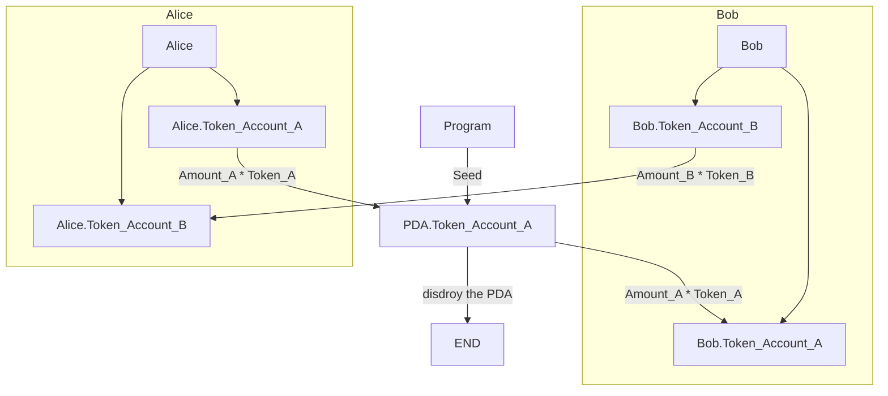

需求: 
1. { Alice }主动发起一个交易:
	1. 她将交付 { Amount_A } 个 { Token+A }
	2. 她希望得到 { Amount_B } 个 { Token_B }
2. { Bob }可以响应这个交易

实现流程:
1. { Alice }指定 { Token_A } 和 { Token_B } 以及数量
2. { Program } 随机生成一个 { ID } 作为 
	Seed : Alice.name + ID,
	创建一个 
	PDA: Seed + Account: Associated_Token_Account_A,
然后从 { Alice.Token_Account_A } 转账 { Amount_A } 个 { Token_A } 到 { PDA.Token_Account_A }
3. { Bob } 试图完成交易的另一半: 
	{ Program } 从 { PDA.Token_Account_A } 转账 { Amount_A } 个 { Token_A } 到 { Bob.Token_Account_A }, 并从 { Bob.Token_Account_B } 转账 { Amount_B } 个 { Token_B } 到 { Alice.Token_Account_B }
	销毁 { PDA }

